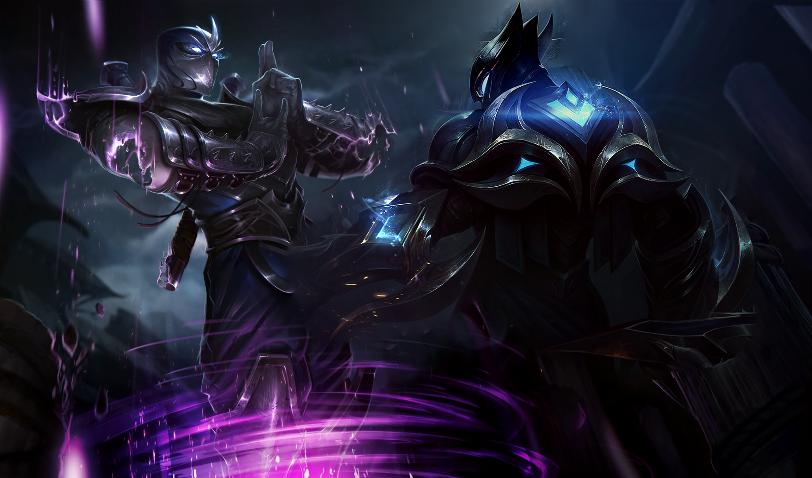
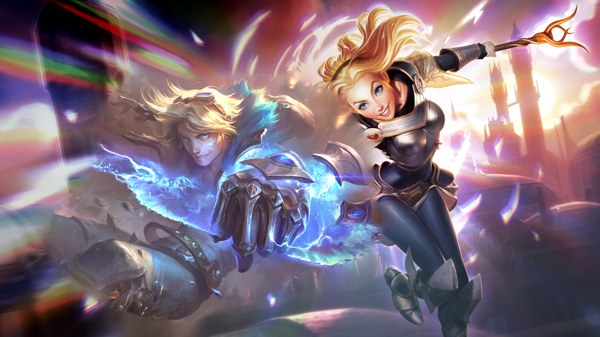

# Poisson-Image-Editing
This is the final project of course DATA130010 Numerical Algorithms with case studiesII

The project is based on [Pérez et al.](https://dl.acm.org/doi/10.1145/882262.882269) and [Matrino et al.](https://www.ipol.im/pub/art/2016/163/). It's a funny image editing program that could add area of other images to the base one, here are some cool examples:

Have fun trying those features in `src`
